# FacultyTrack — NxtWave Attendance & Grooming Audit

FacultyTrack takes instructor attendance from a camera kiosk at each campus,
recognises the instructor's face, checks their grooming and attire against the
NxtWave standards with AI, and sends reports to instructors, reporting partners
and management.

> **In one sentence:** an instructor stands in front of a tablet, the photo is
> matched to their profile, Gemini grades their appearance, and everyone who
> needs to know gets a clear report.

---

## Contents

1. [The big picture](#1-the-big-picture)
2. [System architecture](#2-system-architecture)
3. [A check-in, step by step](#3-a-check-in-step-by-step)
4. [How the AI grades a photo](#4-how-the-ai-grades-a-photo)
5. [Emails and reports](#5-emails-and-reports)
6. [Scheduled work](#6-scheduled-work)
7. [Data model](#7-data-model)
8. [Who can do what](#8-who-can-do-what)
9. [The admin portal](#9-the-admin-portal)
10. [Tech stack](#10-tech-stack)
11. [Run it locally](#11-run-it-locally)
12. [Deploy](#12-deploy)
13. [Repository map](#13-repository-map)

---

## 1. The big picture

<p align="center"></p>

| Who | What they do |
|---|---|
| **Instructor** | Checks in and out at the campus kiosk. Receives their appearance report by email. |
| **BOA** (campus operator) | Runs the kiosk for one campus and sees that campus's records. |
| **Admin / Super admin** | Manages instructors, institutes, users and settings across all campuses. |
| **Reporting partners & management** | Receive daily, campus and escalation reports. |

---

## 2. System architecture

<p align="center"></p>

**Key design choices**

| Choice | Why |
|---|---|
| **Queues stored in MongoDB** (`evaluation_jobs`, `notification_jobs`, `mail_jobs`) | Work survives restarts. Each job has a lease, retries and a fixed ID, so nothing is sent twice. |
| **API and workers in one process** | Simple to run at today's scale. `PROCESS_ROLE=api` / `worker` can split them later. |
| **The kiosk app loads the live website** | Web changes reach every tablet without publishing a new APK. |
| **Photos in R2, served through short-lived signed links** | Cheap storage; nobody can browse photos without a link the server issues. |
| **Prompt caching on Gemini** | The long grading instructions are cached, so about 80 % of input tokens are billed at the cheap cached rate. |

---

## 3. A check-in, step by step

<p align="center">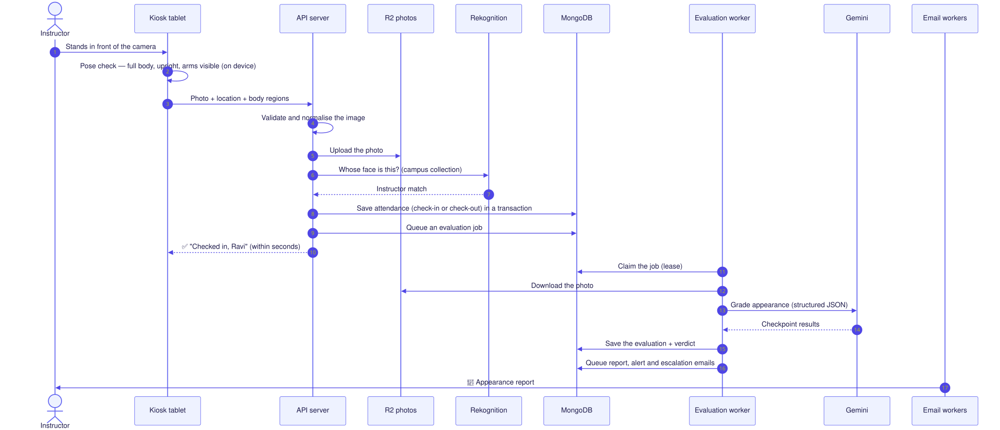</p>

**What the kiosk decides on the device, before anything is uploaded**

<p align="center"></p>

**How the server decides check-in or check-out**

<p align="center"></p>

---

## 4. How the AI grades a photo

Every analysis uses **Gemini 2.5 Flash-Lite** with a strict JSON schema, so the
answer always has the same shape. The checkpoints come from
[`src/checkpoints.js`](./grooming_api_node/src/checkpoints.js) and the rules from
[`src/prompts.js`](./grooming_api_node/src/prompts.js).

<p align="center"></p>

**Report sections:** ID card · Grooming (hair, beard, face) · Attire · Accessories
(belt, ID lanyard) · Footwear — each row is PASS / FAIL with an observation and
a reason.

---

## 5. Emails and reports

<p align="center"></p>

| Report | Who gets it | Link |
|---|---|---|
| **Appearance report** | The instructor | `/reports/<code>/day/<date>/check-in` — never expires |
| **Daily report** | Daily report recipients | `/daily-report/<DD-MM-YYYY>/<code>` — never expires |
| **Campus report** | Same recipients (switch in Settings) | `/daily-report/<DD-MM-YYYY>/<campus-name>/<code>` |
| **Escalation** | Reporting partners | Links to each failed day |
| **Missed check-in / check-out** | The instructor | Sent at the times set in Settings |
| **Weekly summary** | The instructor (switch) | `/reports/<code>/week/<date>` |

Every email is a job in `mail_jobs` or `notification_jobs`: retried on failure,
never sent twice, and counted in a delivery run.

---

## 6. Scheduled work

<p align="center">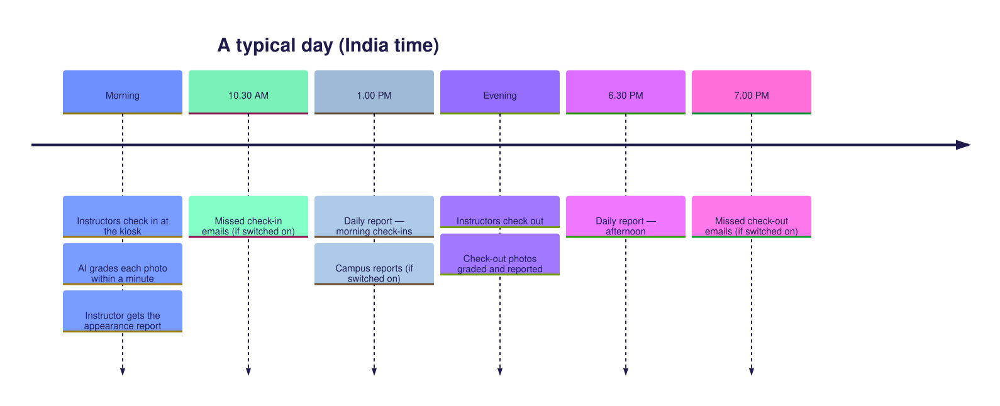</p>

| Job | Runs in | When |
|---|---|---|
| Daily & campus reports | Server scheduler | Times set in **Settings → Reports** |
| Missed check-in / check-out emails | Server scheduler | Times set in **Settings → Notifications**; skipped on holidays |
| Close open check-ins, weekly report, reminders (legacy) | `cron-jobs.org` → `/api/v2/reports/cron/*` | External schedule, protected by `CRON_SECRET` |
| Instructor & institute sync | Admin button | **Settings → Sync Data** (from BigQuery) |

> Times are examples — every send time is set by an admin, not fixed in code.

---

## 7. Data model

<p align="center"></p>

**Other collections:** `app_settings` (one document per settings area),
`report_delivery_runs` (email runs and permanent report links), `audit_logs`
(who changed what), `password_resets`, `storage_cleanup_jobs`.

**Retention:** attendance, evaluations, reports and photos are kept permanently.
Only internal queue entries and used password-reset codes clean themselves up.

---

## 8. Who can do what

<p align="center"></p>

Every admin route checks the role on the server, and a BOA's queries are always
limited to their own campus.

---

## 9. The admin portal

| Page | Path | What it's for |
|---|---|---|
| Dashboard | `/dashboard` | Today at a glance, results, trend, escalations |
| Attendance | `/attendance` | The kiosk camera (single or group) |
| Daily Records | `/daily-records` | Every check-in with filters, photos and reports |
| Institutes | `/institutes` | Attendance and compliance per campus |
| Instructors | `/instructors` | Add, edit, import; `/instructors/records?name=…` for one person's history |
| Users | `/users` | Admins and BOAs |
| Escalations | `/dashboard/escalations` | Three failed check-ins in a row |
| Settings | `/settings/<section>` | Notifications · Identification · Institutes · Sync Data · RP · Reports · Holidays · Config · Audit log |

Filters, searches and open dialogs are kept in the address, so any view can be
reloaded, bookmarked or shared.

---

## 10. Tech stack

| Layer | Technology |
|---|---|
| Web app | React 19, TypeScript, Vite 8, Tailwind CSS 4 |
| Kiosk app | Capacitor 8 Android shell that loads the live site |
| On-device vision | TensorFlow.js pose detection (full body & posture) |
| API | Node.js 24, Express 4, zod validation |
| Database | MongoDB 6 driver (Atlas) |
| AI | Google Gemini 2.5 Flash-Lite, structured JSON output, prompt caching |
| Faces | AWS Rekognition |
| Images | sharp (server), canvas (device) |
| Storage | Cloudflare R2 (S3-compatible) |
| Email | Amazon SES |
| Roster | Google BigQuery |
| Hosting | Vercel (web) · AWS Lightsail, Docker + Nginx (API) |

---

## 11. Run it locally

```powershell
# Terminal 1 — API
cd grooming_api_node
Copy-Item .env.example .env   # fill in the values
npm ci
npm run dev

# Terminal 2 — web app
cd grooming-frontend
Copy-Item .env.example .env   # VITE_API_BASE=http://localhost:8000
npm ci
npm run dev
```

**Checks before every push**

```powershell
cd grooming_api_node;  npm test
cd grooming-frontend;  npm test; npx oxlint --deny-warnings; npx tsc --noEmit; npm run build
```

Never commit `.env` files or the Android signing key.

---

## 12. Deploy

<p align="center"></p>

- **Web:** Vercel deploys `grooming-frontend` from `main` automatically.
- **API:** run `deploy/lightsail/deploy.sh` on the Lightsail host.
- **Kiosk APK:** only needed when the Android shell changes; web changes reach
  tablets automatically.

Full details: [deployment guide](./grooming_api_node/DEPLOYMENT.md) ·
[cost estimate](./docs/COST_ESTIMATION.md) · [AI quality](./docs/AI_QUALITY.md).

---

## 13. Repository map

```text
Nxtgroom/
├── grooming-frontend/          React web app + Android shell
│   ├── src/components/         Pages and UI (Dashboard, DailyAttendanceTable, SettingsPage…)
│   ├── src/lib/                Camera, pose detection, reports, URL helpers
│   ├── src/routes.ts           Every page path and query-string helper
│   └── test/                   Frontend tests (node --test)
├── grooming_api_node/          Node.js API + workers
│   ├── server.js               App setup, security, routers, workers
│   ├── src/routes/             auth · attendance · instructors · admin · dashboard · reports
│   ├── src/services/           AI engine, workers, emails, reports, sync, holidays, audit log
│   ├── src/stores/             Settings, evaluations, delivery runs (MongoDB / DynamoDB)
│   ├── src/prompts.js          Grading instructions for Gemini
│   ├── src/checkpoints.js      Checkpoint tables for men and women
│   └── test/                   Backend tests (node --test)
├── deploy/lightsail/           Server setup, Nginx config, deploy script
└── docs/                       Cost, AI quality, design notes
```
