# Diagram sources

The animated diagrams in the main README are SVG images generated from these Mermaid sources.
To change a diagram: edit its source here, re-render it to `<name>.svg` (Mermaid with `htmlLabels: false`), and keep the flowing-line animation style at the end of the SVG.

## big-picture.svg

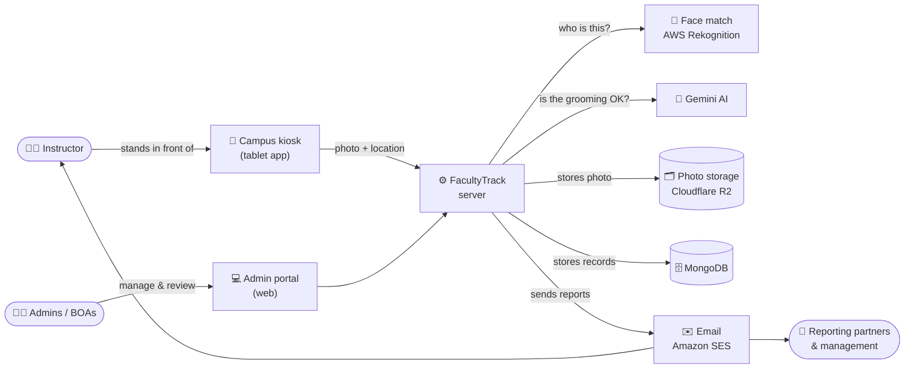

## architecture.svg

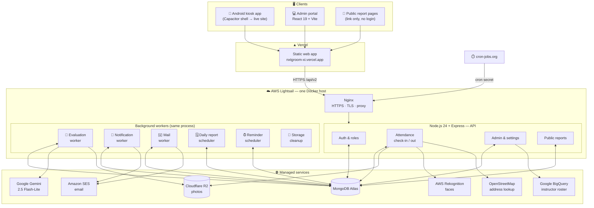

## check-in-sequence.svg

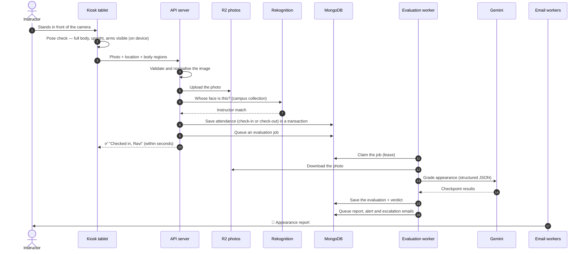

## kiosk-capture.svg

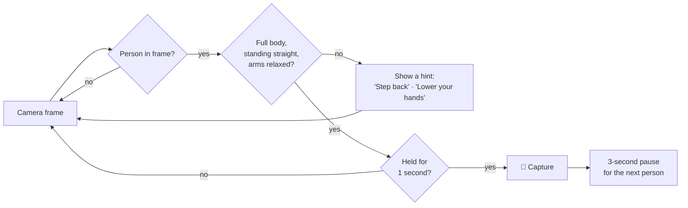

## check-in-or-out.svg

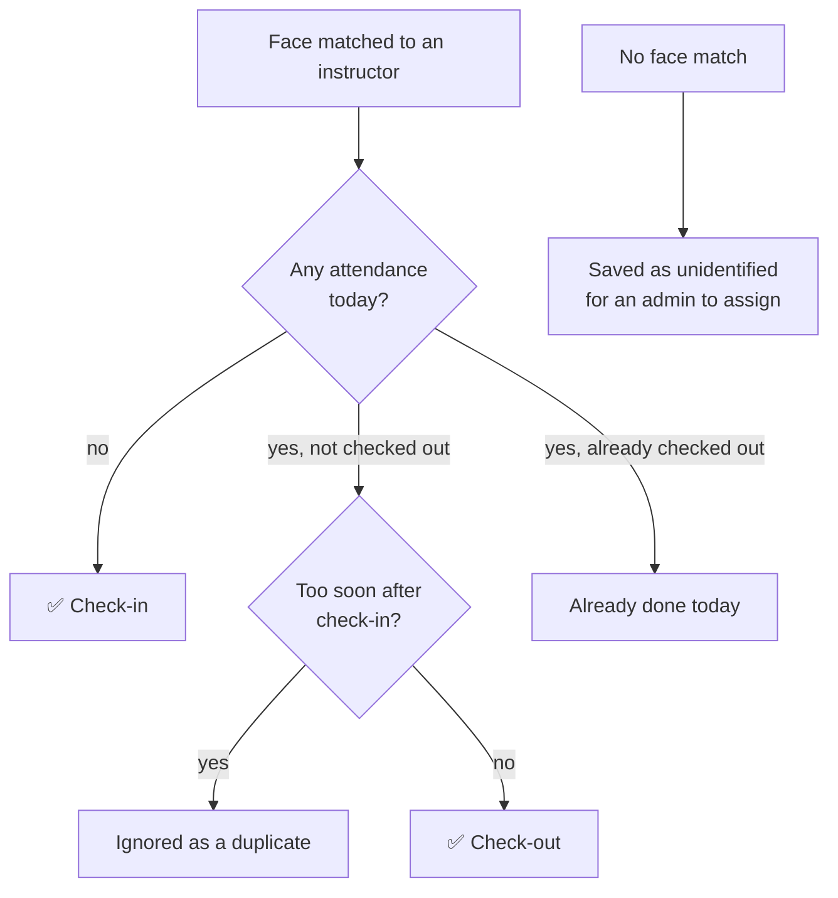

## ai-grading.svg

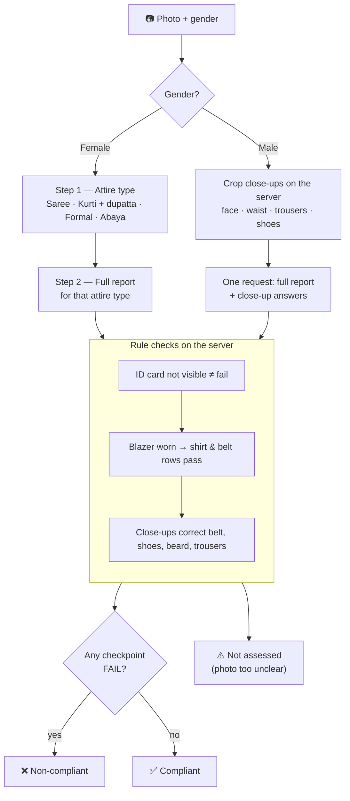

## emails.svg

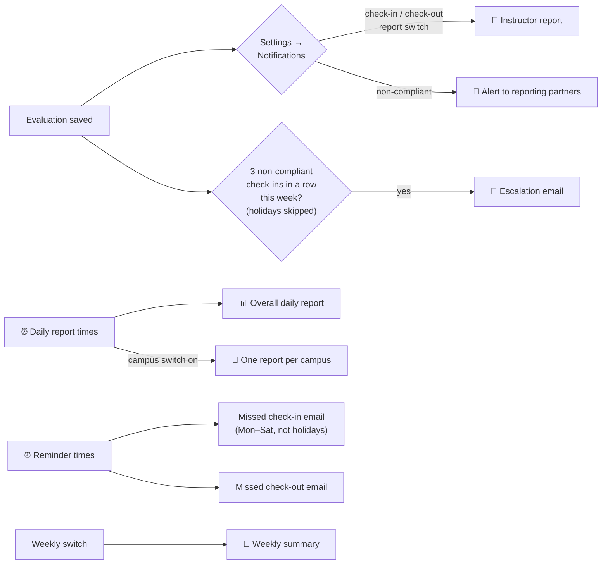

## daily-timeline.svg

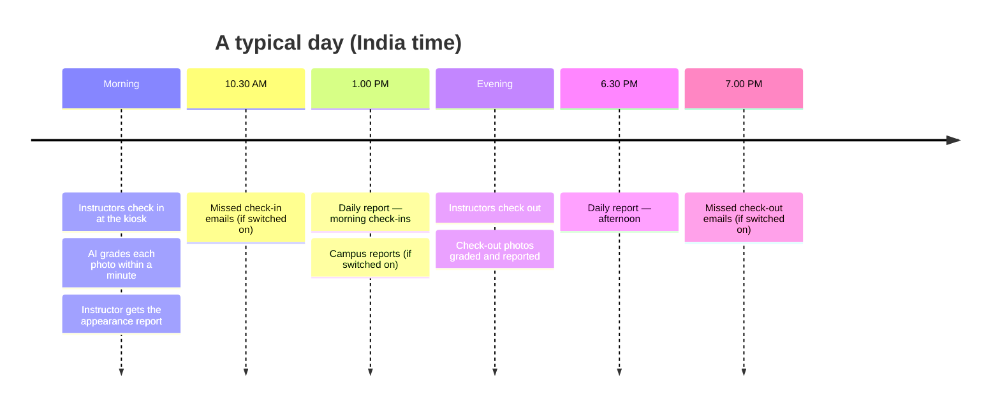

## data-model.svg

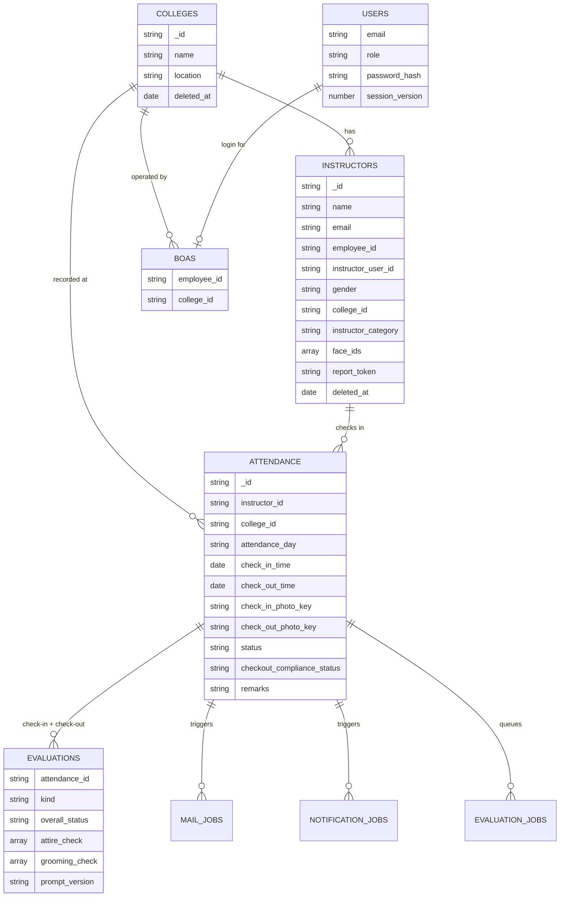

## roles.svg

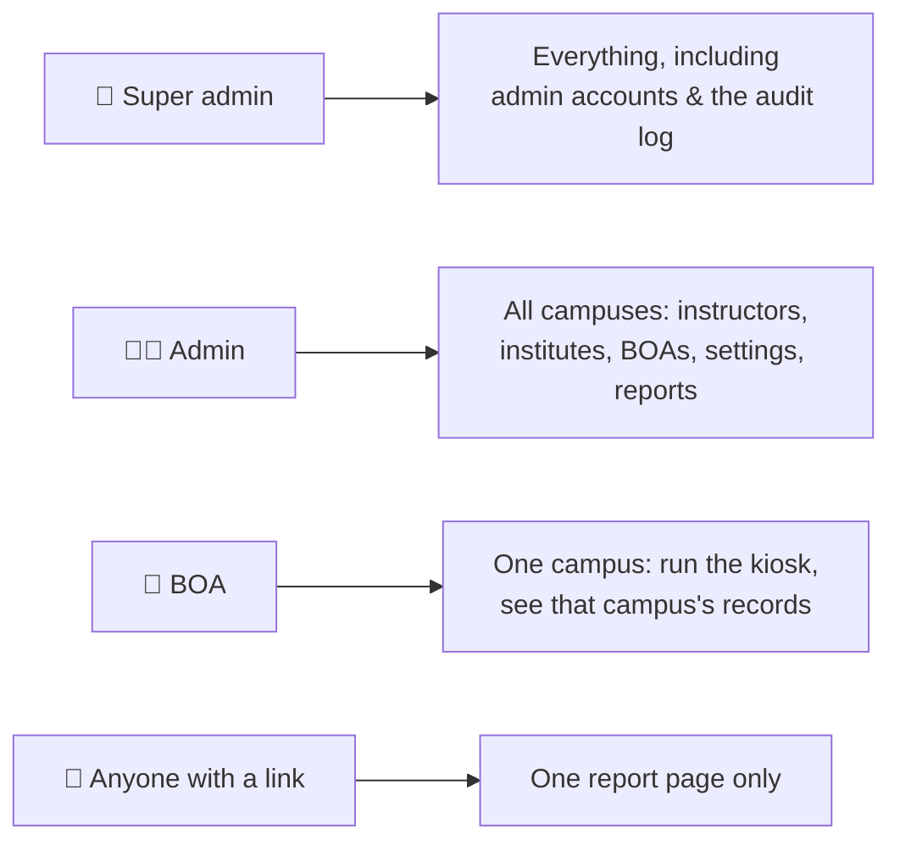

## deploy.svg

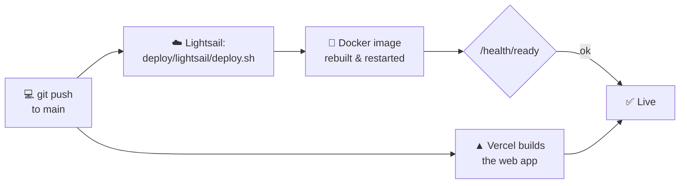
